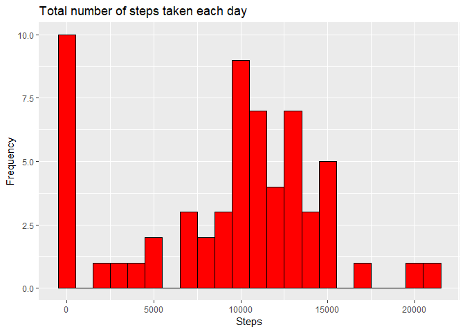
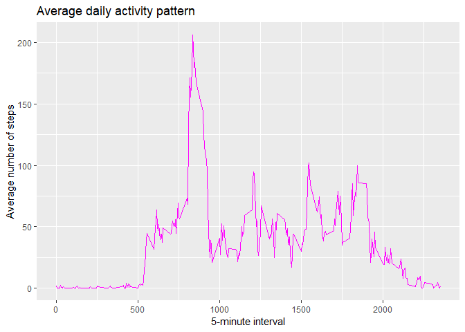
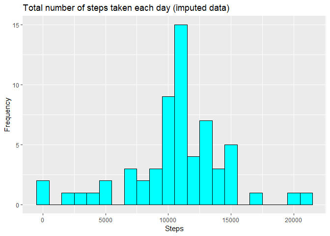
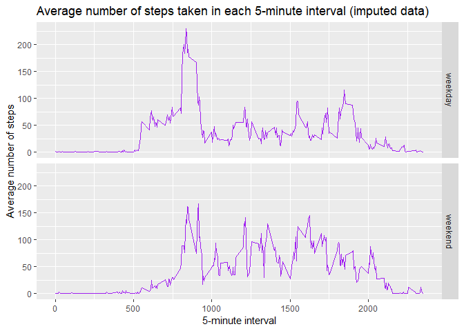

title: “Reproducible research Peer graded assignment 1” output:
html_document: default github_document: default

------------------------------------------------------------------------

``` r
knitr::opts_chunk$set(echo = TRUE) 


## Loading and preprocessing the data

# Load libraries
library(dplyr)
library(ggplot2)

# Load data
activity <- read.csv("activity.csv")

# Preprocess data
activity$date <- as.Date(activity$date)


## What is mean total number of steps taken per day?

# Calculate the total number of steps taken per day
daily_steps <- activity %>% 
  group_by(date) %>% 
  summarise(steps = sum(steps, na.rm = TRUE))

# Make a histogram of the total number of steps taken each day
p <- ggplot(daily_steps, aes(steps)) +
  geom_histogram(fill = "red", color = "black", binwidth = 1000) +
  xlab("Steps") +
  ylab("Frequency") +
  ggtitle("Total number of steps taken each day")

print(p)
```

<!-- -->

``` r
# Calculate and report the mean and median of the total number of steps taken per day
mean_steps <- mean(daily_steps$steps)
median_steps <- median(daily_steps$steps)

mean_steps
```

    ## [1] 9354.23

``` r
median_steps
```

    ## [1] 10395

``` r
## What is the average daily activity pattern?

# Calculate the average number of steps taken in each 5-minute interval across all days
interval_steps <- activity %>% 
  group_by(interval) %>% 
  summarise(steps = mean(steps, na.rm = TRUE))

# Make a time series plot of the average number of steps taken in each 5-minute interval
p <- ggplot(interval_steps, aes(interval, steps)) +
  geom_line(color = "magenta") +
  xlab("5-minute interval") +
  ylab("Average number of steps") +
  ggtitle("Average daily activity pattern")
  
print(p)  
```

<!-- -->

``` r
# Identify the 5-minute interval with the maximum number of steps on average
max_interval <- interval_steps$interval[which.max(interval_steps$steps)]
max_interval
```

    ## [1] 835

``` r
## Imputing missing values

# Calculate the total number of missing values in the dataset
missing_values <- sum(is.na(activity$steps))

# Fill in missing values with the mean number of steps in each 5-minute interval
activity_imputed <- activity
activity_imputed$steps[is.na(activity_imputed$steps)] <- interval_steps$steps[match(activity$interval[is.na(activity$steps)], interval_steps$interval)]

# Make a histogram of the total number of steps taken each day with the imputed data
daily_steps_imputed <- activity_imputed %>% 
  group_by(date) %>% 
  summarise(steps = sum(steps))

p <- ggplot(daily_steps_imputed, aes(steps)) +
  geom_histogram(fill = "cyan", color = "black", binwidth = 1000) +
  xlab("Steps") +
  ylab("Frequency") +
  ggtitle("Total number of steps taken each day (imputed data)")

print(p)
```

<!-- -->

``` r
# Calculate and report the mean and median of the total number of steps taken per day with the imputed data
mean_steps_imputed <- mean(daily_steps_imputed$steps)
median_steps_imputed <- median(daily_steps_imputed$steps)

mean_steps_imputed
```

    ## [1] 10766.19

``` r
median_steps_imputed
```

    ## [1] 10766.19

``` r
## Are there differences in activity patterns between weekdays and weekends?

# Create a new factor variable indicating whether a given date is a weekday or weekend day
activity_imputed$day_type <- ifelse(weekdays(activity_imputed$date) %in% c("Saturday", "Sunday"), "weekend", "weekday")
activity_imputed$day_type <- as.factor(activity_imputed$day_type)

# Calculate the average number of steps taken in each 5-minute interval across all days, separately for weekdays and weekends
interval_steps_imputed <- activity_imputed %>% 
  group_by(interval, day_type) %>% 
  summarise(steps = mean(steps))
```

    ## `summarise()` has grouped output by 'interval'. You can override using the `.groups` argument.

``` r
# Make a panel plot comparing the average number of steps taken in each 5-minute interval on weekdays and weekends
p <- ggplot(interval_steps_imputed, aes(interval, steps)) +
  geom_line(color = "purple") +
  facet_grid(day_type ~ .) +
  xlab("5-minute interval") +
  ylab("Average number of steps") +
  ggtitle("Average number of steps taken in each 5-minute interval (imputed data)")

print(p)
```

<!-- -->
